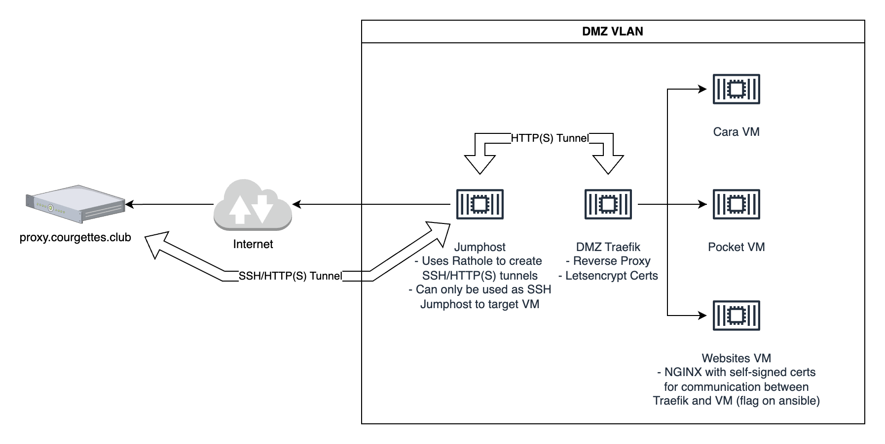

# Courgettes Cloud Infra + Guest Manual

## Infra

The network is split into VLANs.

### Main VLAN

Contains trusted things like laptops, desktops, phones, printer, NAS, PI, Proxmox. Can access every other network.

### Entertainment VLAN

Contains devices like TVs, sound bars, chromecast. Can be accessed from guest network.

### Guest VLAN

Guests can connect here. Can access entertainment stuff.

### Crusted VLAN

Contains devices like IoT shit, smart things. Can only connect to internet.

### DMZ VLAN

Contains websites and services that can be accessed from the internet. Currently there are no ports forwarded from the
internet and Rathole is used to create a tunnel to a public IP.

#### Details for DMZ

The DMZ VLAN is as follows:


We assume a proxy VM is available somewhere with a public IP. Its hostname is `proxy.courgettes.club`.

A jumphost VM is spawned in the VLAN. It creates a SSH and HTTP(S) tunnel to the proxy. The SSH tunnel
binds `proxy.courgettes.club:2222` to `jumphost:22`.
The HTTP(S) tunnels bind `proxy.courgettes.club:80` to `traefik.local-dmz.courgettes.cloud:80`
and `proxy.courgettes.club:443` to `traefik.local-dmz.courgettes.cloud:443` respectively.

The Traefik VM therefore listens to and trafic on port 80 and 443 of `proxy.courgettes.club`. This effectively allows
the Traefik VM to generate LetsEncrypt certs for domains that are `CNAME`d to `proxy.courgettes.club`.

The Websites VM has a self-signed certificate that is trusted by the Traefik VM for inside-VLAN communication.
The `install_nginx` ansible role handles the creation of the self signed cert for all hosts needing one.

## Guest Manual

### Getting a new box

Ask the admin to create a new box. Parameters include:

- Number of CPU
- RAM size
- SSD size (for base drive)
- Backed up/replicated HDD size (for data, will be mounted to `/mnt/mounted-raid`)

If it's the first time you ask for a box, sned pulbic shs kye.

### Connecting to a box

Your box will be deployed in the `10.10.5.0/24` network. To access it, use the following ssh config:

```
host jumphost
    hostname proxy.courgettes.club
    user jumper
    port 2222

host mybox
    ProxyJump jumphost
    hostname 10.10.5.<IP>
    user root
```

> Note: all vms have fail2ban installed, don't fuck up the ssh config or you'll get soft banned.

### Network access

Your box has unrestricted outbound internet access.

Regarding inbound internet:

- if you need to publish one or more websites:
    - `CNAME` your domain to `proxy.courgettes.club`
    - Ask for a base `nginx` config with self-signed certs to be installed.
    - Add your nginx reverse proxy config for each one of the websites.
        - A sample can be found in `proxmox/roles/install_websites_cts/templates/nginx-reverse-proxy.conf`.
        - You only need to map the HTTPS service to your website.
    - Add config to `proxmox/roles/install_traefik_cts/templates/dmz-config.yml`
        - This will both map your domain to your website but also create a letsencrypt cert for it.
        - In this config you can also configure things like http->https redirections, www.domain.com to domain.com
          redirections, mapping multiple domains to the same website, ...
    - Ask for the traefik config to be redeployed. This is not really a piece that should be re-run often so the
      dependency to admin access should be OK.
- if you want to have custom ports mapped to your machine (i.e. game server):
    - change the `rathole.conf` config file
    - ask for a change to be redeployed.